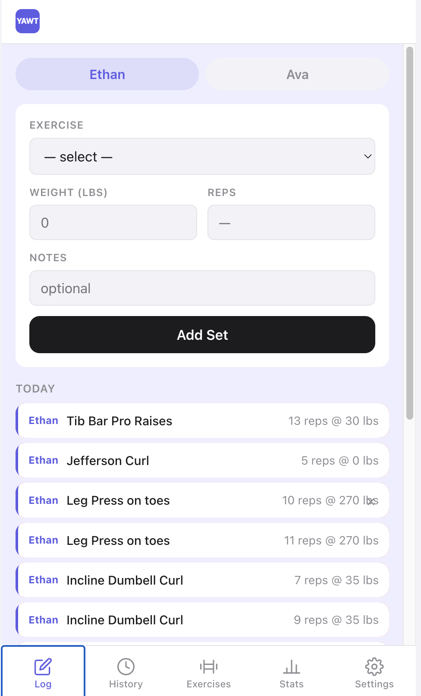
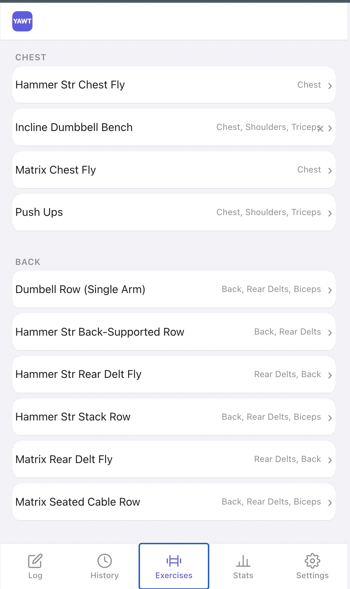
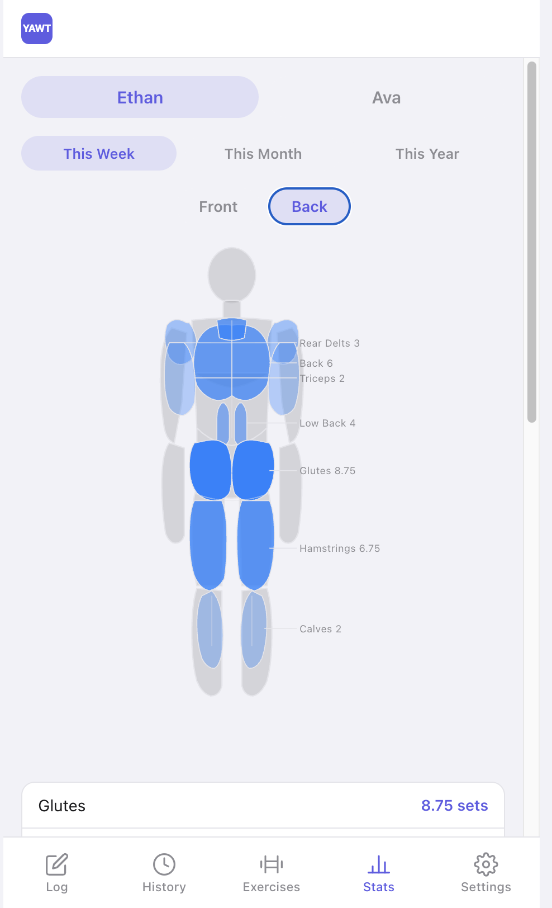

# YAWT — Yet Another Workout Tracker

A mobile-first PWA to log gym sets, track muscle volume over time, and manage their exercise library. Built with React + Vite, backed by Google Sheets, and hosted on GitHub Pages.

Allows you to define each exercise's target muscles, allowing you to count partially towards a muscle group, matching science based research on muscle growth. Further, allows you to define exercises very specifically, so that you are sure to be tracking progress over time under the same exact conditions. 

## Screenshots

| Log | Exercises | Stats |
|-----|-----------|-------|
|  |  |  |

## TODO

- [ ] Make a graph that shows progressions more clearly
- [ ] Reject sets with 0 reps the same way 0 weight is rejected
- [ ] Fix muscle group weights not saving properly when creating an exercise on mobile
- [ ] Clear weight field for all users when a new exercise is selected
- [ ] Make a better login page with a actuall description of the app
- [ ] change the logo to look a little less like shop pay

